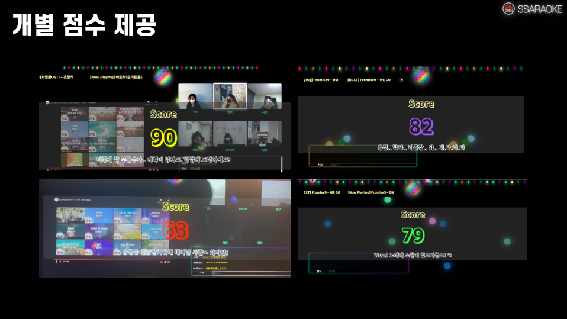

#   SSARAOKE (온라인 노래방 서비스) 

SSAFY + KARAOKE

주제:  WebRTC

개발기간:  2022.01.04 ~ 2022.02.18  [7주]

​																												

​																																

### 목차 

---

0. 팀소개
1. 서비스 소개
2. 기술 스택
3. 와이어프레임 및 ERD
4. 사이트 레이아웃 및 디자인

---

​																																							

### 0. 팀소개

---

정구아(Leader, BE) : Backend, WebRTC, Server, Api, 발표

배지환(BE): Backend, Api, Server, WebRTC

유혜승(BE): Backend, Jira, Api, Server, WebRTC

서승원(FE): Frontend (Home, Login, Youtube)

김혜란(FE): Frontend (Lobby, Mypage)

이현우(FE): 노래방 생성 모달, 노래방 내부 component 디자인 및 각종 기능, 로비&방 내부 채팅 기능, 모드별 노래방 UI, 화면 및 호응 이펙트, 노래방 점수, 듀엣 컨텐츠 구현  // WebRTC - Frontend 세션 연결 // UCC 기획 및 제작

​                                                 	

​									      					

### 1. 서비스 소개

---

"온라인 노래방 서비스" TJ미디어 공식 유튜브 채널을 기반으로 한 화상 노래방 서비스를 제공합니다.  

방 당 최대 6인까지 입장 가능하며 공간의 제약 없이 서비스를 이용할 수 있습니다.  

다양한 레이아웃, 에코와 음성 변조등의 음향 이펙트, 추가적인 리액션 시그널을 포함한 컨텐츠를 지원합니다.  

​																										

#### 1.1 기획 배경

코로나로 인한 정부 방역지침에 따라, 많은 사람들의 취미인 노래방을 사용할 수 없게 되었다.

이에 따라, 우리 팀은 거리나 날씨 등 외부환경에 영향 받지않고, WebRTC를 활용하여 

온라인에서 노래방을 이용할 수 있는 서비스를 기획하게 되었다. 

프로젝트 기획의 시작은 팀원의 한 마디에서 시작되었다. 

'아, 노래방 가고싶다.'

​																																		

#### 1.2 기존 서비스의 한계와 보완

SSARAOKE는 기존의 화상 서비스들과 달리, 노래방이라는 컨셉에 집중적으로 초점을 맞추어,

사용자가 더욱 노래방의 현장감, 흥미를 느낄 수 있도록 보완하고, 기획하였다.

​																			

#### 1.3 다양한 기능

​									

​																																																																							

### 2. 기술 스택

---

​																									

#### 2.1 사용한 기술 스택

​																																										

#### 2.2 외부지원(tj 미디어)

tj 미디어에 이메일을 통해 협조 요청 메일을 보냈고, 감사하게도 tj 미디어 측에서 협조해주셨다.

​																

​																					

### 3. 와이어프레임 및 ERD

---

​																											

####   3.1 와이어 프레임

​																																

####   3.2 ERD

​																																															

​																																				

### 4. 사이트 레이아웃 및 디자인

---

​																													

